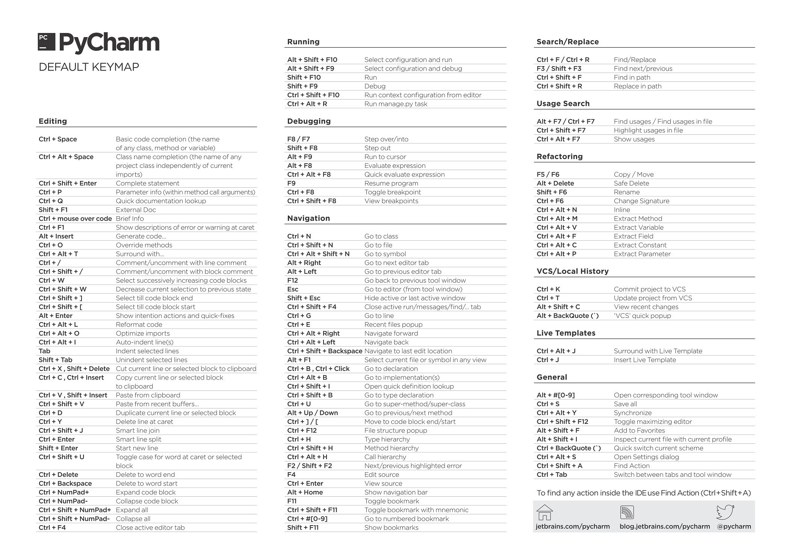

# IDE Notes


### PyCharm

搜索快捷键的组合: Press Ctrl+Shift+A (Find Action feature) and type keyword (e.g. 'column') 

编辑

- Column Selection:  ```Alt +Shift+Insert```
- ```ALT 左键```： 列模式选择
- ```Ctrl + /``` 行注释
- ```Ctrl + Shift + /``` 块注释
- ```Ctrl + Delete``` 删除到字符结束
- ```Ctrl + Backspace``` 删除到字符开始
- ```CTRY Y```: 删除当前行
- ```Ctrl + Space``` 基本的代码完成（类、方法、属性）
- ```Ctrl + Alt + L``` 代码格式化
- ```CTRL W```: 选中当前单词，继续按，选中它所属的行/IF/方法.

查找/替换(Search/Replace)

- ```F3``` 下一个   ```Shift + F3``` 前一个
- ```Ctrl + Shift + F``` 全局查找  ```Ctrl + Shift + R``` 全局替换

<p align="center">
    
</p>


### PyCharm and PyQT-4 or PyQT-5

