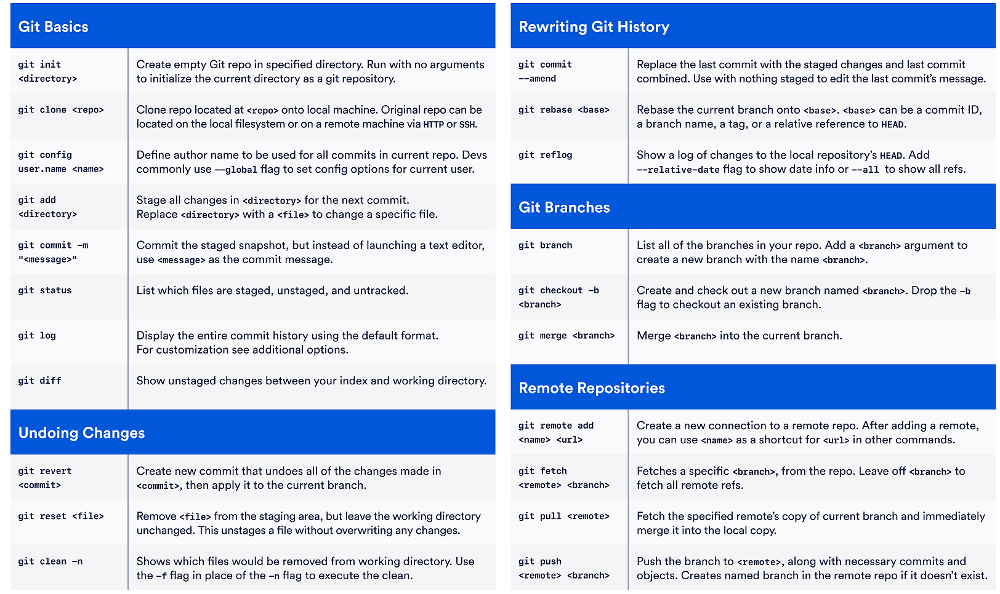
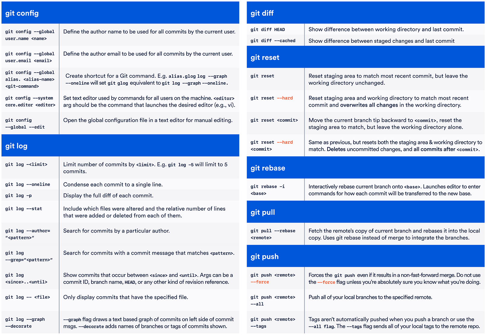

# Cheatsheets

### Language

- [Markdown](https://github.com/adam-p/markdown-here/wiki/Markdown-Cheatsheet)
- [Markdown example](./examples/markdown_samples.md.txt)

### Command lists

- [git](https://github.com/flyhigher139/Git-Cheat-Sheet/blob/master/README.md)
- [vim](https://github.com/hackjutsu/vim-cheatsheet)

### Sheets

    

    

